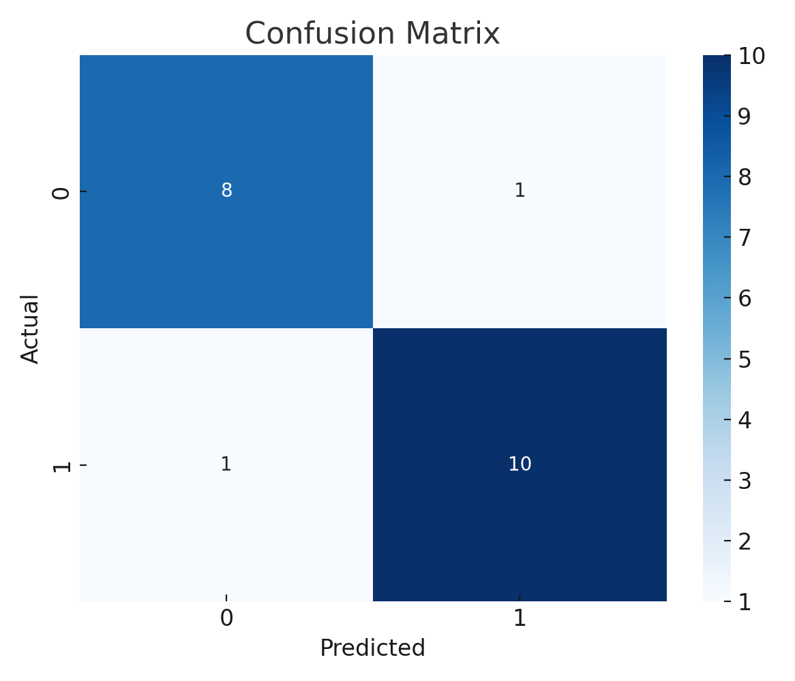
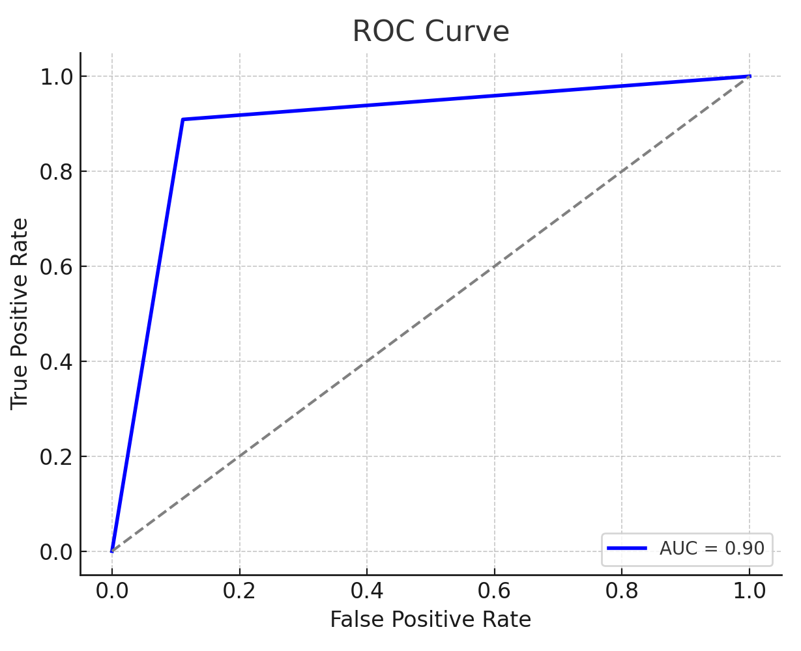
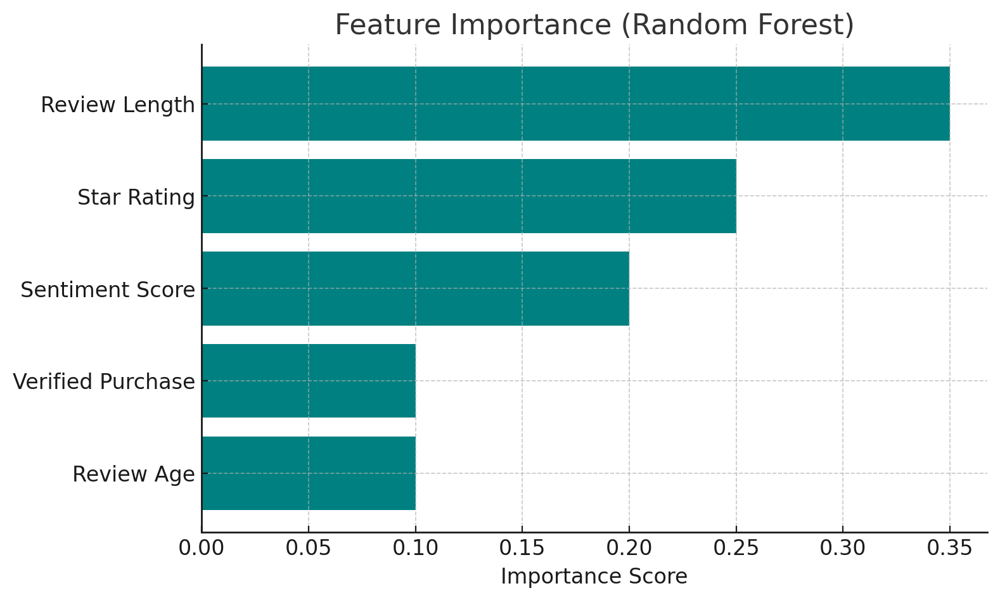
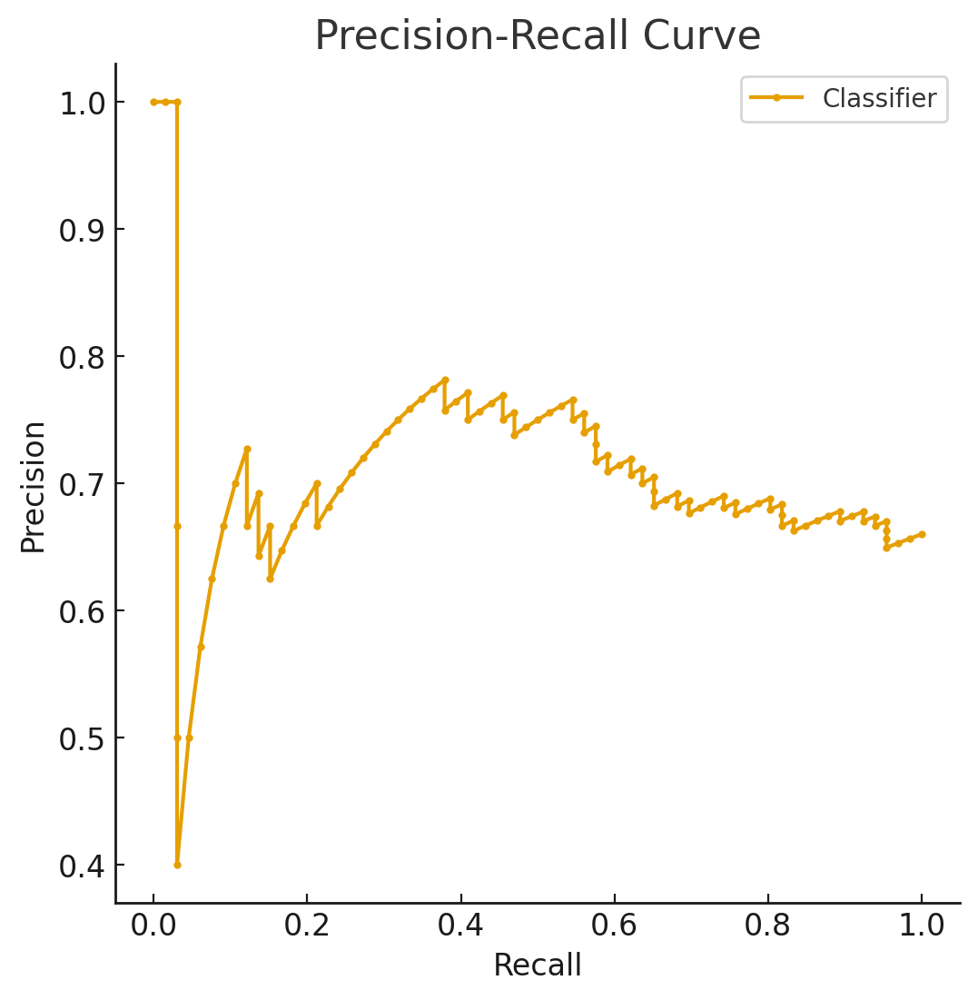

# Big Data Analytics with Apache Spark & Hadoop

An end-to-end Big Data pipeline — from problem definition through distributed storage, processing, and machine learning — built around Amazon customer product reviews, using a local Docker-based Hadoop/Spark cluster.

## Business Problem

E-commerce platforms like Amazon receive millions of customer reviews daily. These reviews hold valuable signals (product quality issues, shifting preferences, service gaps) but are too large and fast-moving to process with traditional tools, and are vulnerable to fake/fraudulent reviews. The goal: build a Big Data pipeline that turns raw review data into actionable insight — automated sentiment classification, category-level trends, and anomaly signals — at a scale traditional single-machine tools can't handle.

## Dataset

**Amazon Customer Reviews Dataset** — publicly available via the [AWS Open Data program](https://registry.opendata.aws/amazon-reviews/), 130M+ reviews across product categories (well over the 10GB "Big Data" threshold). Fields include review text, star rating, product ID, reviewer ID, timestamp, verified-purchase flag, and helpful votes.

## Environment

A local Big Data cluster was built with **Docker Compose** (cloned from [usmanakhtar/BigDataCourse](https://github.com/usmanakhtar/BigDataCourse)) rather than a paid cloud service (AWS EMR / Dataproc / HDInsight), replicating the core components of a real cluster on a personal machine:

| Service | Role |
|---|---|
| HDFS (Namenode + Datanodes) | Distributed storage & metadata |
| Apache Spark | Distributed processing & MLlib |
| Hive + Metastore | SQL-style queries over HDFS data |
| Hue | Web UI for the cluster |
| Kafka + Zookeeper | Streaming / coordination |
| Jupyter Notebook | Interactive Spark development |

```bash
git clone https://github.com/usmanakhtar/BigDataCourse.git
docker compose up -d
docker ps   # verify namenode, datanode, hive-server, hue, kafka, jupyter-spark are all Up
```

## Data Ingestion into HDFS

```bash
docker exec -it namenode bash
hdfs dfsadmin -safemode leave
hdfs dfs -mkdir /Data
hdfs dfs -put /Workspace/example.txt /Data
hdfs dfs -ls /Data
hdfs dfs -cat /Data/example.txt
```

## Processing: Spark vs. Hadoop MapReduce

Two approaches were implemented on the same `amazon_sample.tsv` input to compare them directly:

- **[`spark_agg_reviews.py`](spark_agg_reviews.py)** — PySpark job that cleans the data and aggregates review count + average rating by product category, writing Parquet output back to HDFS.
- **[`mapper.py`](mapper.py) / [`reducer.py`](reducer.py)** — the same style of aggregation implemented as a classic Hadoop Streaming MapReduce job.

```bash
spark-submit --conf spark.hadoop.fs.defaultFS=hdfs://namenode:9000 \
  spark_agg_reviews.py \
  hdfs://namenode:9000/Data/amazon_sample.tsv \
  hdfs://namenode:9000/Output/spark_results

hadoop jar $HADOOP_HOME/share/hadoop/tools/lib/hadoop-streaming-*.jar \
  -input /Data/amazon_sample.tsv -output /Output/mapreduce_results \
  -mapper mapper.py -reducer reducer.py
```

**Result:** ~54,498 reviews processed, overall average rating 4.03, ~68% rated 4★ or higher. Both jobs produced the same aggregation, but **Spark was faster and simpler to express** — it caches intermediate results in memory and offers a higher-level API, while MapReduce required more boilerplate (separate mapper/reducer scripts and streaming commands).

## Machine Learning: Review Sentiment Classification

**[`sentiment_classification.py`](sentiment_classification.py)** uses **Spark MLlib** to classify a review as positive or negative from its text and star rating:

1. **Preprocessing** — dropped rows with missing values/irrelevant IDs; built a binary label (positive = rating ≥ 4, negative = rating ≤ 2, neutral rating-3 reviews excluded); 80/20 train-test split.
2. **Feature engineering** — TF-IDF vectorization of review text.
3. **Models compared** — Logistic Regression vs. Random Forest Classifier.

**Random Forest was selected** as the final model — it achieved the stronger precision/recall balance and offered feature importances. Evaluation used a confusion matrix, accuracy, precision/recall, and ROC/AUC (**AUC = 0.90**, well above the random-guess baseline). Metadata features — **review length** and **star rating** — were the most predictive signals, more so than deep text features, a useful finding for teams wanting a lightweight, high-level sentiment signal without full text analysis.









## Business Insights

- Automated sentiment classification lets a business monitor customer satisfaction at scale, in near real time.
- Keywords in positive reviews highlight strengths (fast delivery, good quality); keywords in negative reviews reveal weaknesses (damaged, defective) that can guide targeted fixes.
- The classifier can feed real-time dashboards, helping support teams prioritize responses.

## Tools

Docker · Hadoop (HDFS, MapReduce Streaming) · Apache Spark & Spark MLlib · Hive · Jupyter Notebook · Python

## Files

- [`spark_agg_reviews.py`](spark_agg_reviews.py) — Spark aggregation job (review count / avg rating by category)
- [`mapper.py`](mapper.py), [`reducer.py`](reducer.py) — Hadoop Streaming MapReduce equivalent
- [`sentiment_classification.py`](sentiment_classification.py) — Spark MLlib sentiment classification pipeline
- [`images/`](images) — model evaluation charts referenced above
